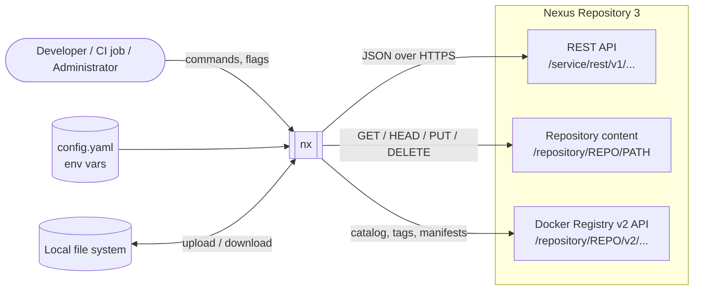
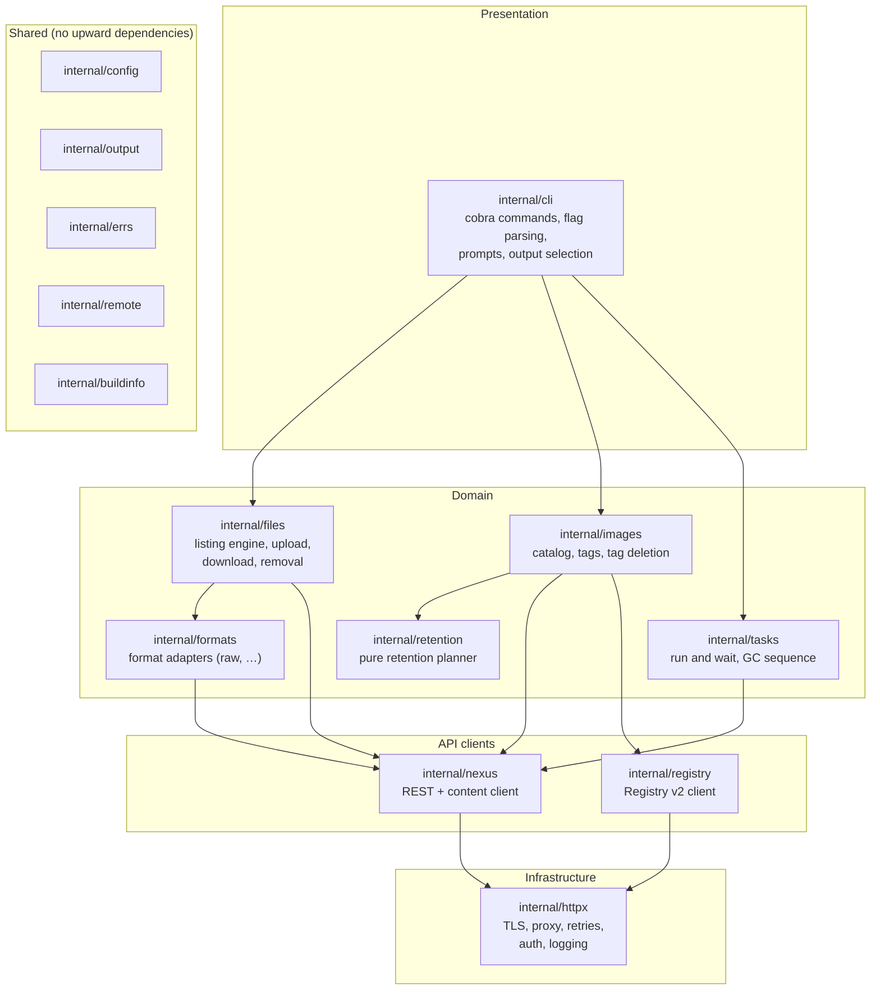
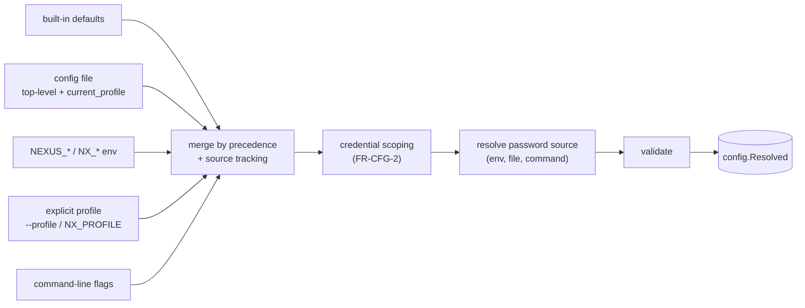
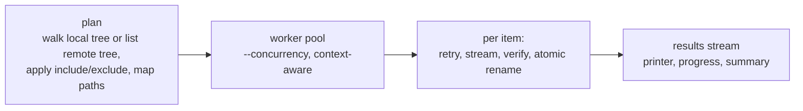
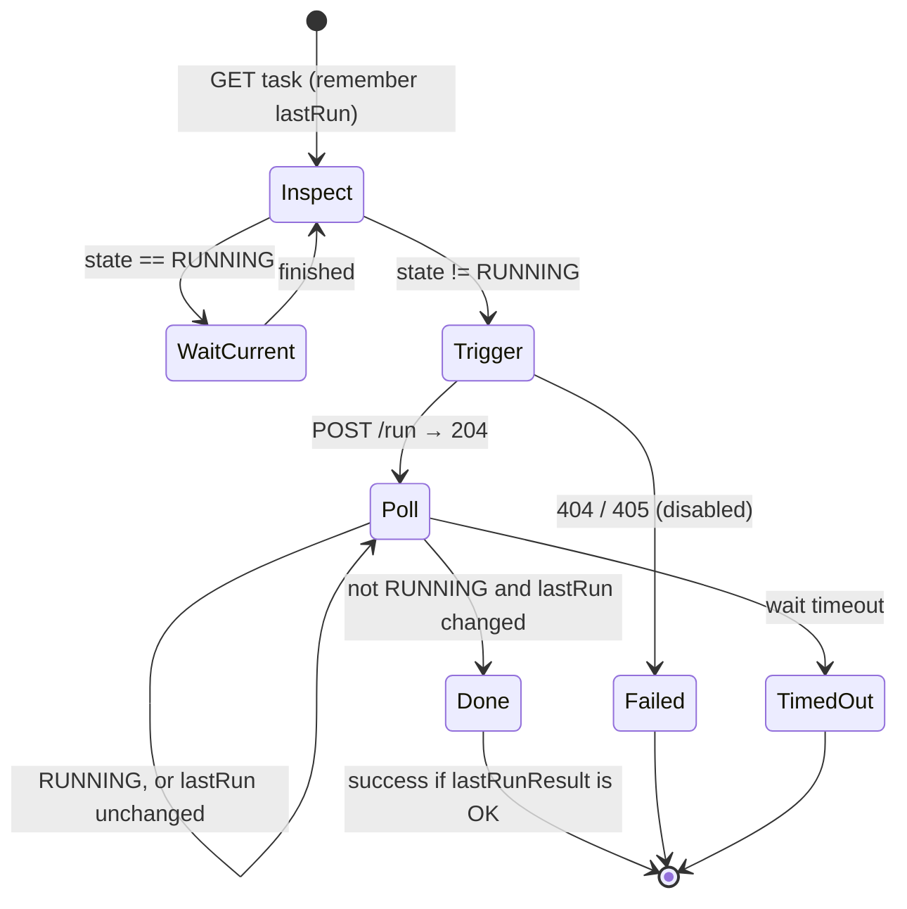
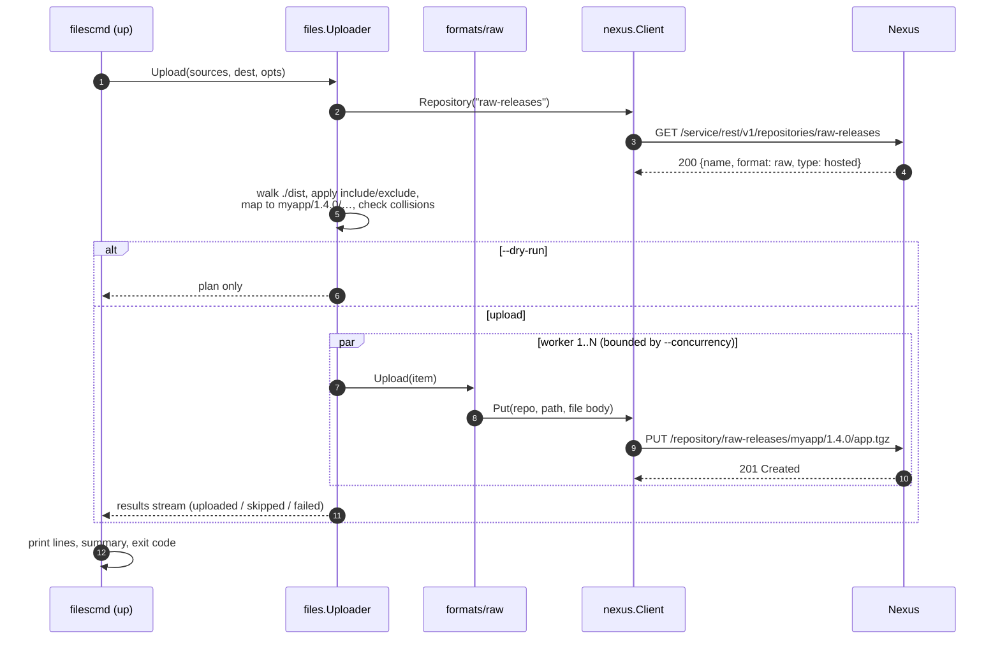
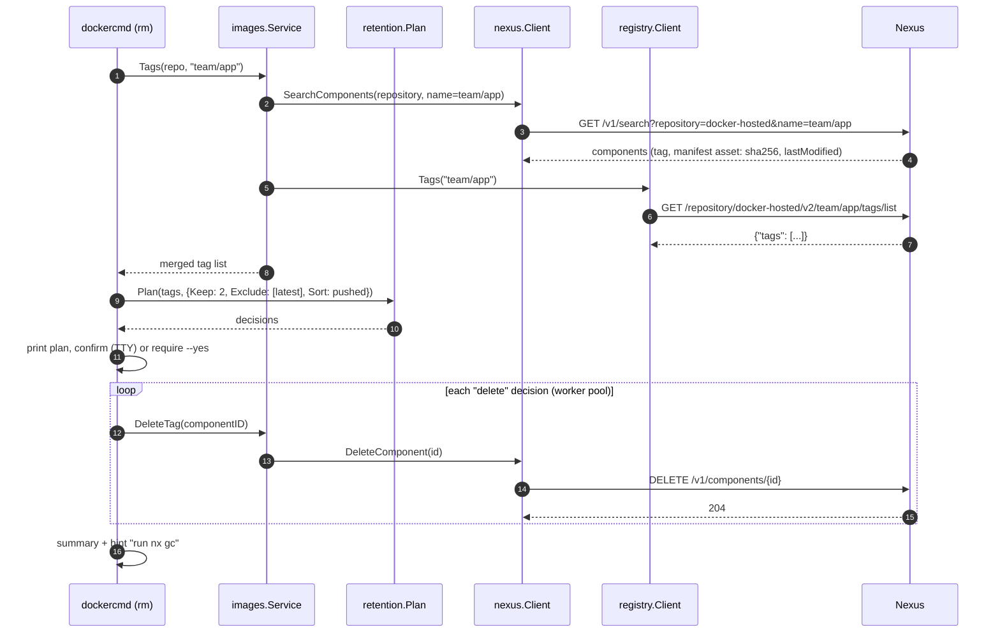
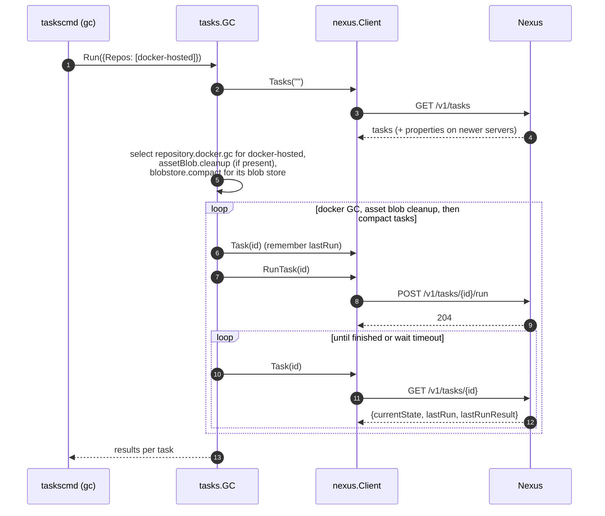

# nx: Architecture

| | |
|---|---|
| **Status** | Draft for review |
| **Version** | 0.1 |
| **Date** | 2026-09-26 |
| **Related documents** | [Specification](specification.md) · [Nexus API notes](nexus-api.md) · [Roadmap](roadmap.md) |

This document describes **how** `nx` is built: its structure, the responsibilities of each package,
the main runtime flows, and the decisions behind them. Requirements are defined in
[specification.md](specification.md) and referenced by ID (for example `FR-UP-4`).

---

## Contents

1. [Goals and architectural drivers](#1-goals-and-architectural-drivers)
2. [System context](#2-system-context)
3. [Layered structure](#3-layered-structure)
4. [Repository layout](#4-repository-layout)
5. [Components](#5-components)
6. [Key runtime flows](#6-key-runtime-flows)
7. [Cross-cutting concerns](#7-cross-cutting-concerns)
8. [Testing strategy](#8-testing-strategy)
9. [Build, CI and release](#9-build-ci-and-release)
10. [Extending nx](#10-extending-nx)
11. [Architecture decision records](#11-architecture-decision-records)

---

## 1. Goals and architectural drivers

| Driver | Consequence for the design |
|---|---|
| **One static binary, no runtime dependencies** (NFR-PLAT-2) | Pure Go, `CGO_ENABLED=0`, minimal third-party code (cobra and a YAML parser only). |
| **Grows into a full Nexus CLI** (more formats, admin resources) | Command groups map to domain packages; format-specific behaviour sits behind *format adapters*; the REST client is organised by API resource. |
| **Works across Nexus versions** (§3.3 of the spec) | Runtime capability detection and fallback strategies instead of version checks; tests run against two API "dialects". |
| **Safe for destructive operations** | Every deletion is split into a *plan* (pure, testable, printable in `--dry-run`) and an *execution* step. |
| **Scriptable** | Strict separation of stdout and stderr, a stable JSON contract, typed errors mapped to exit codes. |
| **Testable without a real server** | Consumer-defined interfaces, an in-memory fake Nexus, golden-file tests for command output; end-to-end tests against real Nexus containers. |
| **Large repositories** | Streaming iterators over paginated APIs, bounded worker pools, no full buffering of files or listings. |

---

## 2. System context



`nx` talks to a single base URL per profile. All three Nexus surfaces are reached under that URL,
so no Docker connector port has to be configured
([ADR-004](#adr-004-registry-api-through-repositoryrepov2)).

---

## 3. Layered structure



**Dependency rules**

1. Dependencies point downwards only. No package imports `internal/cli`.
2. Domain packages declare the small interfaces they need (for example `files.API`). The API clients
   satisfy them implicitly. Domain code is therefore tested with fakes, and clients are tested with
   `httptest`.
3. Shared packages (`config`, `output`, `errs`, `remote`, `buildinfo`) import nothing from the
   layers above.
4. Only `cmd/nx` and `internal/cli` know about cobra. Only `internal/httpx` builds `http.Client`
   values.

A test in CI (`internal/archtest`) checks rules 1 and 4 with `go list -deps`.

---

## 4. Repository layout

```
nx/
├── cmd/nx/main.go            # entry point: build root command, signals, exit code mapping
├── internal/
│   ├── cli/                  # presentation layer (one sub-package per command group;
│   │   │                     #   the "cmd" suffix avoids clashes with domain package names)
│   │   ├── root.go           #   root command, global flags
│   │   ├── factory.go        #   lazily constructed dependencies (config, clients, IO)
│   │   ├── reposcmd/         #   nx repos
│   │   ├── filescmd/         #   nx ls | up | down | rm
│   │   ├── dockercmd/        #   nx docker ls | tags | rm
│   │   ├── taskscmd/         #   nx tasks ..., nx gc
│   │   ├── apicmd/           #   nx api
│   │   ├── statuscmd/        #   nx status
│   │   ├── configcmd/        #   nx config ...
│   │   └── versioncmd/       #   nx version
│   ├── config/               # model, loading, profiles, precedence, credential scoping, secrets
│   ├── httpx/                # http.Client construction and RoundTripper chain
│   ├── nexus/                # Nexus REST & content client, models, pagination, errors, capabilities
│   │   └── nexustest/        #   in-memory fake Nexus for tests (two API dialects)
│   ├── registry/             # Docker Registry v2 client with challenge-based auth
│   ├── remote/               # parsing/normalisation of REPO/PATH and image references
│   ├── files/                # listing engine, upload/download engine, removal planner
│   ├── formats/              # format adapter registry; raw adapter
│   ├── images/               # container image operations (docker and oci formats)
│   ├── retention/            # retention planner (pure functions)
│   ├── tasks/                # task runner and GC orchestration
│   ├── workpool/             # bounded, cancellable worker pool
│   ├── output/               # IO streams, TTY detection, printers, progress, prompts, humanize
│   ├── errs/                 # error kinds, hints, exit codes
│   ├── buildinfo/            # version, commit, date (set via -ldflags)
│   └── archtest/             # dependency-rule tests
├── test/e2e/                 # end-to-end tests against a real Nexus (build tag "e2e")
├── scripts/                  # e2e bootstrap (start Nexus, create repositories, push images)
├── docs/                     # this documentation
├── .github/workflows/        # ci.yml, e2e.yml, release.yml
├── .golangci.yml
├── .goreleaser.yaml
├── Makefile
├── go.mod, go.sum
├── LICENSE
└── README.md
```

The Go module path is `github.com/yand3r3d3v/nx`. The `go` directive is set to the oldest Go
release still supported upstream (Go 1.26 at the time of writing). Release binaries are built with
the newest stable Go.

---

## 5. Components

### 5.1 Entry point and command framework (`cmd/nx`, `internal/cli`)

`main` does four things:

1. creates a root context cancelled on SIGINT/SIGTERM (`signal.NotifyContext`); a second signal
   exits immediately with code 130;
2. builds the command tree with `cli.NewRootCmd(factory)`;
3. executes it;
4. maps the returned error to an exit code (`errs.ExitCode`) and prints it (§5.11).

Commands follow a pattern proven in large Go CLIs such as `gh`: each command has an `Options` struct,
a constructor that binds flags, and a `run` function with all the logic. The constructor accepts an
optional `runF` override so tests can check flag parsing without executing anything.

```go
type LsOptions struct {
    IO        *output.IOStreams
    Files     func() (*files.Service, error) // lazily built from config
    Target    remote.Path
    Recursive bool
    Long      bool
    Match     []remote.Pattern
    Sort      files.SortKey
}

func NewCmdLs(f *cli.Factory, runF func(context.Context, *LsOptions) error) *cobra.Command
```

`cli.Factory` is a small dependency container whose members are built lazily and at most once per
invocation:

```go
type Factory struct {
    IO       *output.IOStreams
    Config   func() (*config.Resolved, error)
    Nexus    func() (*nexus.Client, error)
    Registry func(repo string) (*registry.Client, error)
    Now      func() time.Time
}
```

Lazy construction keeps `nx version` and `nx completion` fast and lets them work without any
configuration.

### 5.2 Configuration (`internal/config`)

Responsibilities: locating and parsing the YAML file, reading environment variables, merging the
sources in precedence order (FR-CFG-1), applying the credential scoping rule (FR-CFG-2), resolving
password sources, validating, and recording where each value came from (for `nx config view`).



* Every setting is stored as `Value[T]{V T; Source Source}`. The merge is a pure function over a list
  of layers, which makes precedence easy to test with tables.
* The *connection unit* is `url`, `user` and the password. Credentials are accepted from their layer
  only if that layer has the same or higher precedence than the layer that supplied the URL, or if
  both layers name the same normalised URL.
* Secrets are held in a `Secret` type whose `String()`/`MarshalJSON()` return `"***"`, so they cannot
  leak through logging or `config view` by accident.
* Unknown YAML keys are collected with their paths and reported as warnings (FR-CFG-6). Decoding is
  done in two passes: into typed structs, and into a generic map to detect unknown keys.

### 5.3 HTTP transport (`internal/httpx`)

`httpx.NewClient(opts)` returns an `*http.Client` with this `RoundTripper` chain:

```
retry  →  user-agent  →  auth (Basic, pre-emptive)  →  logging  →  http.Transport
```

| Concern | Implementation |
|---|---|
| TLS | `tls.Config{MinVersion: TLS12}`; system roots plus `--ca-cert` bundle; `InsecureSkipVerify` only with `--insecure` (warning printed by the CLI layer). |
| Proxy | `http.ProxyFromEnvironment`. |
| Timeouts | Dial 10 s, TLS handshake 10 s, response headers 60 s; API calls additionally get `--timeout` through the request context; transfers use an idle-read watchdog (5 min without bytes) instead of a total timeout. |
| HTTP/2 | `ForceAttemptHTTP2: true` (a custom `TLSClientConfig` otherwise disables it). |
| Retries | Idempotent methods only (`GET`, `HEAD`, `PUT`, `DELETE`); network errors, 429, 502, 503, 504; exponential backoff (500 ms, ×2, ±20% jitter), `Retry-After` honoured, 3 retries by default. Request bodies are replayed through `Request.GetBody`: file uploads provide a `GetBody` that reopens the file; stdin uploads have none and are not retried. |
| Auth | Pre-emptive `Authorization: Basic …` when credentials are configured. Go's redirect policy already drops `Authorization` on cross-host redirects; a test pins this behaviour. |
| Logging | `log/slog` at debug level: method, redacted URL, status, duration, attempt number; headers at `-vv` with `Authorization`/`Cookie`/`Set-Cookie` redacted. |
| User agent | `nx/<version> (<os>/<arch>)`. |

### 5.4 Nexus client (`internal/nexus`)

The client is organised by API resource. It returns typed models and never exposes `*http.Response`,
except through the explicit raw method used by `nx api`.

```go
type Client struct { /* base URL, http.Client, capabilities, server info */ }

// Repositories
func (c *Client) Repositories(ctx context.Context) ([]Repository, error)
func (c *Client) Repository(ctx context.Context, name string) (Repository, error)

// Components, assets, search: iterators over continuation-token pages
func (c *Client) Components(ctx context.Context, repo string) iter.Seq2[Component, error]
func (c *Client) Assets(ctx context.Context, repo string) iter.Seq2[Asset, error]
func (c *Client) SearchComponents(ctx context.Context, q SearchQuery) iter.Seq2[Component, error]
func (c *Client) SearchAssets(ctx context.Context, q SearchQuery) iter.Seq2[Asset, error]
func (c *Client) DeleteComponent(ctx context.Context, id string) error
func (c *Client) DeleteAsset(ctx context.Context, id string) error
func (c *Client) UploadComponent(ctx context.Context, repo string, form UploadForm) error

// Browse API (capability; returns ErrUnsupported on older servers)
func (c *Client) Browse(ctx context.Context, repo, dir string) ([]BrowseNode, error)
func (c *Client) DeleteFolder(ctx context.Context, repo, dir string) error

// Repository content
func (c *Client) Stat(ctx context.Context, repo, path string) (ContentInfo, error) // HEAD
func (c *Client) Open(ctx context.Context, repo, path string, off int64) (io.ReadCloser, ContentInfo, error)
func (c *Client) Put(ctx context.Context, repo, path string, body Body) error
func (c *Client) DeleteContent(ctx context.Context, repo, path string) error

// Tasks
func (c *Client) Tasks(ctx context.Context, taskType string) ([]Task, error)
func (c *Client) Task(ctx context.Context, id string) (Task, error)
func (c *Client) RunTask(ctx context.Context, id string) error
func (c *Client) StopTask(ctx context.Context, id string) error
func (c *Client) TaskTemplate(ctx context.Context, taskType string) (TaskTemplate, error) // capability
func (c *Client) CreateTask(ctx context.Context, t TaskTemplate) (Task, error)            // capability

// Status and raw access
func (c *Client) Status(ctx context.Context) (Status, error)
func (c *Client) Raw(ctx context.Context, req *http.Request) (*http.Response, error)
```

**Pagination.** `continuationToken` pagination is implemented once, as a generic iterator
(`iter.Seq2[T, error]`, Go 1.23+ range-over-func). Page sizes are never assumed: they differ
between versions (10 vs. 100) and between endpoints (search: 50).

**Model normalisation.** Models are normalised when decoded, so domain code never sees version
differences:

* asset paths and raw component names lose any leading `/` (§3.3 of the spec);
* an empty-string and a `null` component `version` both become `""`;
* optional attributes that only newer servers send (e.g. `docker.created`, `blobStoreName`) are
  pointer or zero-able fields;
* timestamps are parsed into `time.Time` in UTC.

**Errors.** Non-2xx responses become `*nexus.APIError`:

```go
type APIError struct {
    Method, Path string   // path without query secrets
    StatusCode   int
    Message      string   // from JSON body, text body or reason phrase
    FaultID      string   // "siesta-faultid", when present
    Validation   []ValidationError
}
```

The decoder understands the three error body shapes that Nexus produces: the *siesta* fault object,
the validation array `[{"id","message"}]`, and plain text or HTML, where the HTTP reason phrase
often carries the message (see [nexus-api.md](nexus-api.md#error-responses)).

**Capabilities and server info.** `Client.ServerInfo()` parses the `Server` header
(`Nexus/3.96.3-01 (COMMUNITY)`) from the first response. The first use of an optional feature
records whether the server supports it (for example the Browse API: a 404 on an existing repository
means "unsupported"; task creation: 405). The result is cached for the process lifetime and used by
the strategy selection in the domain layer.

### 5.5 Registry client (`internal/registry`)

A Docker Registry HTTP API v2 client, scoped to one repository. It covers the few calls `nx` needs:

```go
func New(hc *http.Client, base *url.URL, creds Credentials) *Client // base = <url>/repository/REPO/
func (c *Client) Catalog(ctx context.Context) iter.Seq2[string, error]
func (c *Client) Tags(ctx context.Context, image string) iter.Seq2[string, error]
func (c *Client) Head(ctx context.Context, image, ref string) (Descriptor, error) // digest, media type, size
```

* Pagination uses `?n=<page>` and follows the RFC 5988 `Link: <…>; rel="next"` header. Nexus
  supports both on `_catalog` and `tags/list` (verified).
* `Head` sends an `Accept` list covering OCI index/manifest and Docker manifest list/v2 media types,
  and reads `Docker-Content-Digest`.
* Authentication: Basic credentials are sent pre-emptively when configured. On a
  `401` with a `WWW-Authenticate: Bearer realm=…,service=…,scope=…` challenge (anonymous or
  token-realm setups), the client obtains a token from the realm, with Basic credentials if
  available, caches it per scope, and retries once.
* The base URL defaults to `<url>/repository/REPO/`. A configured registry URL override (spec §3.4,
  Q2) replaces it.

### 5.6 Files domain (`internal/files`)

Path-addressed operations: listing, upload, download, removal. They work for every format; only
upload needs a format adapter (§5.7).

#### 5.6.1 Listing engine

Nexus has no single efficient "list a directory" call that works in all versions. The engine
therefore chooses among four strategies:

| Strategy | Endpoint | Returns | Constraints |
|---|---|---|---|
| **Browse** | `GET /v1/repositories/{repo}/browse?path=/dir` | one level: names, file/folder flag | Newer servers only; no size, time or checksum; eventually consistent |
| **Group search** | `GET /v1/search/assets?repository=R&group=…` | full asset metadata (IDs, checksums, sizes, times) | Exact: `group="/dir"` (quoted); recursive: `group=/dir*` only if the value has ≥ 3 characters before `*` and contains no whitespace or quotes; eventually consistent |
| **Scan** | `GET /v1/assets?repository=R` | every asset of the repository, full metadata | Always correct and strongly consistent; cost grows with repository size (10 or 100 items per page) |
| **Stat** | `HEAD /repository/R/PATH` | existence, size, `ETag` (SHA-1), `Last-Modified` | Single files only; a directory answers 404 |

The `group` search parameter is the key: raw components store their directory in `group`
(`/dir/sub`) the same way in every tested version, while `name`/`path` differ by version. Values with
spaces break unquoted wildcard searches (verified), so they use a different strategy.

Selection rules:

| Operation | Preferred | Fallback(s) |
|---|---|---|
| one level (`ls`) | Browse, joined with exact group search for `-l`/`--json` metadata | recursive group search, aggregated to one level; then Scan |
| recursive below `dir` (`ls -r`, `down`, `rm -r`) | Group search `group=/dir*` with client-side prefix filter | Browse traversal plus exact group search per folder (whitespace in names); then Scan |
| recursive below the root or a short directory | Browse traversal (newer servers), plus exact group search per folder when metadata is needed | Scan |
| single file resolution | Stat | exact group search (to obtain an asset ID) |

Every strategy produces the same stream of `files.Entry` values. Results are always filtered on the
client by exact path prefix, because search-based strategies may return false positives
(`/dir/sub*` also matches `/dir/subway/…`). If the server rejects a search query (HTTP 400, e.g. the
wildcard rule), the engine falls back to the next strategy and does not fail.

#### 5.6.2 Transfer engine



* **Planning** is pure: it turns sources, destination, patterns and a listing into a list of
  `Transfer{Local, Remote, Size}` items. It checks for collisions (two sources mapping to one target)
  and for unsafe remote paths (FR-DOWN-5) before any data moves. `--dry-run` prints the plan.
* **Upload.** The raw adapter streams the file with `PUT` (default) or the Components API
  (multipart assembled on the fly through `io.Pipe`, so nothing is buffered in memory). The optional
  `--verify` compares the local SHA-1, computed while streaming, with the `ETag` from `HEAD`.
* **Download.** The file is streamed into `<dest-dir>/.nx-<random>.part` while SHA-256 and SHA-1 are
  computed. The expected checksum comes from listing metadata (SHA-256) or from the `ETag` (SHA-1).
  On success the file is `fsync`ed, its modification time is set, and it is renamed over the final
  path. On any failure or cancellation the temporary file is removed.
* **Path sanitisation** (`remote.ToLocal`) rejects absolute paths, `..`, drive letters, NUL and
  control characters, and names reserved on the local OS. It then checks that the cleaned result is
  still inside `DEST`.

#### 5.6.3 Removal

`rm` builds a `DeletionPlan` (the list of targets, with the method chosen for each), shows it,
confirms, and executes it through the worker pool:

* **raw**: `DELETE /repository/R/PATH` per file (needs only the delete privilege);
* **other formats**: `DELETE /v1/assets/{id}` with IDs from the listing;
* **`--server-side`**: one `DELETE /v1/repositories/R/browse?path=…` per directory, then polling
  the listing until the directory is gone.

### 5.7 Format adapters (`internal/formats`)

Format-specific behaviour sits behind a small interface, so new formats can be added without touching
the commands:

```go
type Adapter interface {
    Format() string            // "raw", "maven2", "helm", …
    Capabilities() Capabilities // Upload, PathDelete, …
    // Upload stores one local item at the given path of a hosted repository.
    Upload(ctx context.Context, repo string, item UploadItem) error
}

func Lookup(format string) (Adapter, bool)
```

v1.0 ships the **raw** adapter. `nx up` looks up the adapter for the target repository's format and
fails with a clear message when there is none or when it lacks the `Upload` capability. Later
adapters (maven2, helm, apt, yum, …) can use `PUT` or the Components API. Nexus describes the
multipart fields of each format through `GET /v1/formats/{format}/upload-specs`, which enables a
generic Components API uploader.

### 5.8 Images domain (`internal/images`) and retention (`internal/retention`)

`images.Service` combines the two APIs for repositories of format `docker` or `oci`:

| Operation | Source |
|---|---|
| list images | Registry `_catalog`; fallback: distinct component names |
| list tags + metadata | Search API (`repository`, `name`), merged with Registry `tags/list` |
| delete a tag | Search API → component ID → `DELETE /v1/components/{id}` |

Reasons for the split are in [ADR-005](#adr-005-tag-metadata-from-search-deletion-through-components).

The retention planner is a pure function with no I/O. All of FR-DRM-2 is implemented and tested here:

```go
type Policy struct {
    Keep      int           // 0 = unset
    OlderThan time.Duration // 0 = unset
    All       bool
    Match     []Pattern
    Exclude   []Pattern     // flag values + docker.exclude from config
    Sort      SortKey       // SortPushed | SortSemVer | SortName
    Now       time.Time
}

type Tag struct {
    Name   string
    Pushed time.Time // zero if unknown (not yet indexed) → never a candidate
    Digest string
}

type Decision struct {
    Tag    Tag
    Action Action // Keep | Delete | Skip
    Reason string // "protected (latest)", "newest 2", "beyond newest 2", "not semver", …
}

func Plan(tags []Tag, p Policy) ([]Decision, error)
```

The same `[]Decision` drives the dry-run table, the confirmation prompt, the execution and the JSON
output, so what is shown is exactly what is executed.

### 5.9 Tasks and GC (`internal/tasks`)

The task runner implements the "trigger and wait" state machine of FR-GC-4:



Polling starts at 1 s and backs off to 10 s. `lastRun` is compared with the value read before the
trigger, not with the client clock, so clock skew does not matter. A run request that fails because
the task is already running (Nexus answers `500`) is detected by re-reading the state.

`tasks.GC` builds on the runner: discover tasks → filter (by properties when exposed) → optionally
create missing tasks from templates → run Docker GC tasks → run asset blob cleanup tasks (where the
server has them) → run compaction tasks → report, including blob store sizes before and after.

### 5.10 Output (`internal/output`)

* `IOStreams` wraps stdin, stdout and stderr, with TTY detection per stream and colour enablement
  (`NO_COLOR`, `--no-color`, TTY). Tests use buffers with configurable "TTY-ness".
* Commands produce **view models**: plain structs with JSON tags that form the documented contract.
  A `Printer` renders them as:
  * **table**: `text/tabwriter`, upper-case headers, human units; streamed in batches for large
    listings;
  * **JSON**: `encoding/json`, streamed array encoding for large listings; indented on a TTY;
  * **quiet**: identifiers only.
* `Progress` draws a throttled single-line status on stderr (TTY only) and does nothing otherwise.
* `Prompt` asks yes/no or type-the-name confirmations. It refuses to prompt without a TTY, which
  produces the "use --yes" usage error.

### 5.11 Errors and exit codes (`internal/errs`)

```go
type Kind int // Generic(1) Usage(2) Config(3) Auth(4) NotFound(5) Partial(6)
              // Network(7) Timeout(8) Rejected(9) Interrupted(130)

type Error struct {
    Kind  Kind
    Msg   string
    Hints []string
    Err   error // wrapped cause
}

func ExitCode(err error) int
```

Classification happens once, in `errs.Classify(err)`. To keep `errs` free of upward dependencies,
it relies on an interface instead of concrete types: an error that knows its category implements
`Kind() errs.Kind`. For example, `*nexus.APIError` maps its HTTP status, and `nexus` imports `errs`,
not the other way round.

| Cause | Kind |
|---|---|
| cobra/flag errors, validation of arguments | Usage |
| config parse/validation errors | Config |
| `*nexus.APIError` 401/403 | Auth |
| `*nexus.APIError` 404, or domain "not found" | NotFound |
| `*nexus.APIError` 400/405/409/413/422 | Rejected |
| `*nexus.APIError` 5xx | Generic |
| `net.Error`, `*url.Error` with dial/DNS/TLS/x509 causes | Network |
| `context.DeadlineExceeded`, task wait timeout | Timeout |
| `context.Canceled` after SIGINT | Interrupted |
| bulk results with mixed outcomes | Partial (FR-EXIT-1) |

Domain packages return wrapped, typed errors and never exit or print. Only `main` turns errors into
text or JSON (FR-OUT-6) and exit codes.

---

## 6. Key runtime flows

### 6.1 `nx up ./dist raw-releases/myapp/1.4.0/`



### 6.2 `nx docker rm team/app --keep 2`



### 6.3 `nx gc --repo docker-hosted`



---

## 7. Cross-cutting concerns

### 7.1 Concurrency and cancellation

* `internal/workpool` runs `fn(ctx, item)` for a stream of items with a fixed number of goroutines.
  It stops scheduling new items when the context is cancelled and waits for running items to
  return.
* Each worker reports a result (success, skip or failure) to a single collector goroutine, which owns
  the printer and the progress display. No other goroutine writes to stdout or stderr.
* Retries happen inside the HTTP transport, so a retry holds the same worker slot and the
  concurrency limit is respected.
* On SIGINT the root context is cancelled: requests abort, temporary files are removed by deferred
  cleanup, the collector prints a partial summary, and `main` exits with 130.

### 7.2 Security

* No credential ever reaches stdout, stderr or a log (the `Secret` type, redacting logger, redacted
  errors).
* Credential scoping (FR-CFG-2) is enforced in one place (`config.Resolve`) and covered by
  table-driven tests.
* `nx api` refuses absolute URLs to other hosts. Redirects to other hosts lose `Authorization`.
* Downloads are confined to the destination directory (§5.6.2).
* TLS 1.2 is the minimum version. `--insecure` is loud.
* No implicit configuration from the working directory, and no telemetry.
* Supply chain: few dependencies, `govulncheck` in CI, checksums with every release, and signing
  planned (spec NFR-BUILD-4).

### 7.3 Compatibility strategy

| Mechanism | Examples |
|---|---|
| Normalise at the edge | leading-slash raw paths, `null` vs `""` versions, optional attributes |
| Detect on first use, then cache | Browse API, task CRUD, task properties |
| Degrade gracefully | Browse → group search → scan; search `400` → next strategy; missing Docker attributes → empty columns |
| Test both dialects | `nexustest` fake with a *legacy* (3.70-like) and a *modern* (3.96-like) mode; e2e against real containers of both |

### 7.4 Performance

* Iterators pull pages on demand, so memory stays flat for streaming output.
* Scans report progress (items read, pages) on a TTY. For repeated operations within one invocation
  (for example `docker ls -l`), a single scan is preferred over N searches.
* Connection reuse: one `http.Client` per process. `MaxIdleConnsPerHost` equals the configured
  concurrency.

### 7.5 Logging and diagnostics

* `-v`: one debug line per HTTP attempt; `-vv`: headers and truncated API bodies.
* Error messages carry the Nexus fault ID when available.
* `nx status` and `nx config view` are the first tools for troubleshooting, and the README points
  to them.

---

## 8. Testing strategy

| Level | Scope | Tools |
|---|---|---|
| **Unit** | pure logic: config merge and scoping, path and reference parsing, pattern matching, retention planner, plan builders, humanisation, error classification | `testing`, table-driven tests |
| **Client** | `nexus`, `registry`, `httpx`: request construction, pagination, error decoding, retries, auth challenges, redirects | `net/http/httptest`, JSON fixtures captured from real Nexus 3.96.3 and 3.70.1 (`testdata/`) |
| **Domain** | `files`, `images`, `tasks` against the in-memory fake | `nexustest` in *legacy* and *modern* dialects |
| **Command** | whole commands in-process: flags → output → exit code | fake `IOStreams`, `nexustest`, golden files (`go test ./... -update` refreshes them) |
| **End-to-end** | the built binary against real Nexus containers | build tag `e2e`, `scripts/e2e-nexus.sh`, Docker, `crane` for image fixtures |

**The in-memory fake (`internal/nexus/nexustest`)** implements the endpoints `nx` uses: repositories,
components, assets, search (group/name/version with the wildcard rules), browse, content
GET/HEAD/PUT/DELETE, registry catalog/tags, and tasks with a simulated state machine. The two
dialects reproduce the differences listed in spec §3.3: page sizes, leading slashes, wildcard rule,
Browse API and task CRUD availability, and index lag. Fault injection (5xx, delays, resets) tests
retries and partial failures.

**End-to-end environment.** `scripts/e2e-nexus.sh <version>` starts `sonatype/nexus3:<version>`,
waits for `/service/rest/v1/status`, reads the generated admin password, sets a known one, accepts the
Community Edition EULA where required, creates raw, docker and oci hosted repositories, enables the
Docker Bearer Token realm, and pushes image fixtures (single-arch and multi-arch) with `crane`. The
suite runs nightly, on demand, and before every release, against the latest Nexus release and the
oldest supported release.

**Coverage and quality gates:** ≥ 80% statements in `internal/`, race detector on Linux, `golangci-lint`
(errcheck, govet, staticcheck, gosec, revive, …), and `govulncheck`.

---

## 9. Build, CI and release

### 9.1 Makefile targets

| Target | Action |
|---|---|
| `make build` | Build `./bin/nx` for the host platform with version ldflags. |
| `make test` | Unit, client, domain and command tests (`go test ./...`). |
| `make test-race` | Tests with `-race`. |
| `make lint` | `gofmt` check, `go vet`, `golangci-lint run`. |
| `make cover` | Coverage report (`coverage.html`). |
| `make e2e NEXUS_VERSION=3.96.3` | Start Nexus in Docker and run the e2e suite. |
| `make snapshot` | `goreleaser release --snapshot --clean`: cross-compile all targets locally. |
| `make tidy`, `make clean` | Housekeeping. |

### 9.2 GoReleaser (outline)

```yaml
version: 2
project_name: nx
builds:
  - main: ./cmd/nx
    binary: nx
    env: [CGO_ENABLED=0]
    goos: [linux, darwin, windows]
    goarch: [amd64, arm64]
    flags: [-trimpath]
    ldflags:
      - -s -w
      - -X github.com/yand3r3d3v/nx/internal/buildinfo.Version={{.Version}}
      - -X github.com/yand3r3d3v/nx/internal/buildinfo.Commit={{.Commit}}
      - -X github.com/yand3r3d3v/nx/internal/buildinfo.Date={{.CommitDate}}
    mod_timestamp: "{{ .CommitTimestamp }}"
archives:
  - formats: [tar.gz]
    format_overrides:
      - goos: windows
        formats: [zip]
    files: [LICENSE, README.md]
checksum:
  name_template: checksums.txt
changelog:
  use: github
```

### 9.3 GitHub Actions

| Workflow | Trigger | Jobs |
|---|---|---|
| `ci.yml` | push, pull request | lint; unit tests on ubuntu, macos and windows (Go stable and oldstable); race tests on ubuntu; `goreleaser --snapshot` build of all targets; `govulncheck` |
| `e2e.yml` | nightly, manual, before release | matrix over Nexus versions (latest, oldest supported): bootstrap container, run `test/e2e` |
| `release.yml` | tag `v*` | GoReleaser: build, archive, checksums, GitHub Release |

### 9.4 Versioning

Semantic Versioning. `v0.x` releases may change the CLI and the JSON output, with release notes.
From `v1.0.0`, command names, flags, exit codes and the JSON contract (FR-OUT-5) are stable within the
major version. `CHANGELOG.md` follows *Keep a Changelog*.

---

## 10. Extending nx

**Adding a command for a new API resource** (e.g. blob stores):

1. Add models and methods to `internal/nexus` (resource file, e.g. `blobstores.go`) with `httptest`
   tests and fixtures.
2. Add or extend the fake in `nexustest`.
3. If there is non-trivial logic, add a domain package or function that depends on a small
   interface.
4. Add `internal/cli/<group>` with `Options`, flags, a view model (the JSON contract), help text and
   examples, and golden tests.
5. Document the command in the specification and README, with the required privileges.

**Adding upload support for a format** (e.g. `helm`):

1. Implement `formats.Adapter` in `internal/formats/<format>`: choose `PUT` or the Components API
   (see `GET /v1/formats/{format}/upload-specs`).
2. Register it in `formats.Lookup`.
3. Extend `nexustest` and the e2e bootstrap with a repository of that format.
4. No change to `nx up` itself is needed; it dispatches on the repository format.

---

## 11. Architecture decision records

Each record states the context, the decision and its consequences. New dependencies and significant
design changes require a new ADR here.

### ADR-001: Go, cobra and the standard library

* **Context.** A static, cross-platform binary is required. Command trees with nested subcommands,
  help and completion are needed.
* **Decision.** Go. `spf13/cobra` for commands, flags, help and shell completion. Everything else
  from the standard library: `net/http`, `encoding/json`, `mime/multipart`, `text/tabwriter`,
  `log/slog`, `iter`. No `viper`: configuration precedence and credential scoping are specific
  enough to implement directly, and viper would pull in many dependencies.
* **Consequences.** A small dependency tree, a fast build and a simple supply chain. A little more
  code in `internal/config`.

### ADR-002: YAML through `go.yaml.in/yaml/v3`

* **Context.** YAML config files need a parser. `gopkg.in/yaml.v3` was archived in April 2025.
* **Decision.** Use `go.yaml.in/yaml/v3`, the drop-in successor maintained by the YAML organisation.
* **Consequences.** Maintained code with the same API. Can move to v4 once it is stable.

### ADR-003: Raw upload uses HTTP PUT by default

* **Context.** Nexus accepts raw uploads through `PUT /repository/REPO/PATH` (the format's native
  endpoint) and through the Components API (`POST /v1/components`, multipart). The initial draft
  proposed the Components API.
* **Decision.** Default to `PUT`, and keep the Components API as `--method components` /
  `upload.method: components`.
* **Consequences.**
  * `PUT` streams the raw body with a known `Content-Length`: no multipart framing, a simple retry
    per file (re-open and re-send), and natural parallelism.
  * `PUT` needs only the repository `add`/`edit` privileges. The Components API additionally needed
    `read`/`browse` in our tests.
  * Both return no body, so no information is lost. Both obey write policy and content validation.
  * The Components API path stays available and is the foundation for generic uploads of other
    formats later.
  * Open question Q5 in the specification confirms this choice.

### ADR-004: Registry API through `/repository/REPO/v2/`

* **Context.** Docker clients need a connector (port, sub-domain or path routing) because they
  cannot address `/repository/…`. Plain HTTP clients such as `nx` can: Nexus serves the full Registry
  v2 API under `<base>/repository/REPO/v2/`. We verified this on 3.70.1 and 3.96.3, for port
  connectors, `pathEnabled` repositories and the `oci` format.
* **Decision.** Always use `<base>/repository/REPO/v2/` by default. Offer a per-repository override
  only if needed (Q2).
* **Consequences.** No connector ports or extra hosts in the configuration. The same TLS settings and
  credentials as for REST. Works behind a reverse proxy that forwards `/repository/`.

### ADR-005: Tag metadata from Search, deletion through Components

* **Context.** The Registry API gives tag names but no dates. Retention needs push dates and precise
  deletion. The Registry `DELETE /v2/<name>/manifests/<digest>` removes *every* tag that points to the
  digest (verified). Deleting a component removes exactly one tag and leaves other tags with the same
  digest intact (verified).
* **Decision.** Read tags with their metadata from the Search API (`repository`, `name`), merge in
  Registry `tags/list` to cover tags not yet indexed, and delete through
  `DELETE /v1/components/{id}`. Never delete manifests referenced by digest; leave them to the
  server's Docker GC task.
* **Consequences.** Precise, safe deletions and rich metadata (digest, push time, and on newer
  servers build time, size and platform). The search index lag can only reduce the set of deletion
  candidates (FR-DRM-4).

### ADR-006: Runtime capability detection instead of version checks

* **Context.** Behaviour differs between Nexus versions and database back ends (page sizes, raw path
  format, search wildcard rules, available endpoints). Version strings do not reveal the database, and
  new releases appear roughly monthly.
* **Decision.** Normalise data at the client edge, detect optional endpoints on first use, and fall
  back automatically. The server version is informational.
* **Consequences.** Robust against versions we have not tested. Requires a fake that emulates both
  dialects.

### ADR-007: Client-side retention planner

* **Context.** Nexus cleanup policies are server-side, apply to whole repositories, and differ by
  edition. Users want ad-hoc "keep the last N tags of this image" with previews.
* **Decision.** Compute retention in `nx` with a pure planner that has an explicit plan, dry-run and
  confirmation. Nexus cleanup policies remain a separate, complementary mechanism; they can be managed
  through `nx api` and possibly dedicated commands later.
* **Consequences.** Transparent, testable, edition-independent. Deletion costs one request per tag;
  acceptable with bounded concurrency.

### ADR-008: Listing strategies

* **Context.** No single listing API is both efficient and available in every version (§5.6.1).
  `name`/`path` values differ between versions, `group` does not, and whitespace breaks wildcard
  search.
* **Decision.** A listing engine with the Browse, Group search, Scan and Stat strategies, selection
  rules, client-side filtering, and automatic fallback on server rejections.
* **Consequences.** Correct results everywhere and fast results where possible, at the cost of a more
  complex (and heavily tested) component.

### ADR-009: Configuration precedence and credential scoping

* **Context.** CI jobs configure with environment variables, humans use config files and profiles,
  and both happen on the same machine. A naive merge could send one server's credentials to another
  server.
* **Decision.** Flags > explicit profile > environment > default profile/file > defaults, plus the
  credential scoping rule of FR-CFG-2.
* **Consequences.** Predictable behaviour that `nx config view` explains. Credentials never cross
  servers implicitly.

### ADR-010: Stable JSON contract and exit codes

* **Context.** Scripts depend on output shape and exit codes.
* **Decision.** Commands render documented view models, never raw Nexus responses. Exit codes follow
  a fixed table (spec §7.4). Both are covered by golden tests.
* **Consequences.** Nexus API changes do not leak into `nx` output. Changing the contract requires a
  major version.

### ADR-011: Consumer-defined interfaces and an in-memory fake Nexus

* **Context.** Most logic (planning, fallbacks, retries, partial failures) must be tested quickly
  and deterministically, including the behaviour of old versions.
* **Decision.** Domain packages depend on minimal interfaces. `nexustest` provides an in-memory
  server with legacy and modern dialects and fault injection. Real-server tests run in the separate
  e2e suite.
* **Consequences.** Fast, hermetic unit and command tests. The fake has to be maintained alongside
  the client, and the e2e suite keeps it honest.

### ADR-012: Directory upload maps contents, not the directory itself

* **Context.** `cp -r src dst/` creates `dst/src/`, and `rsync` makes the result depend on a trailing
  slash of the source, which shells add automatically when completing directory names.
* **Decision.** Uploading directory `SRC` to `REPO/DIR/` places the *contents* of `SRC` under `DIR/`,
  like `aws s3 cp --recursive`. `down` uses the same rule in reverse.
* **Consequences.** Deterministic results independent of trailing slashes. `up` and `down` are exact
  inverses. The behaviour is shown in help and in `--dry-run` output.
